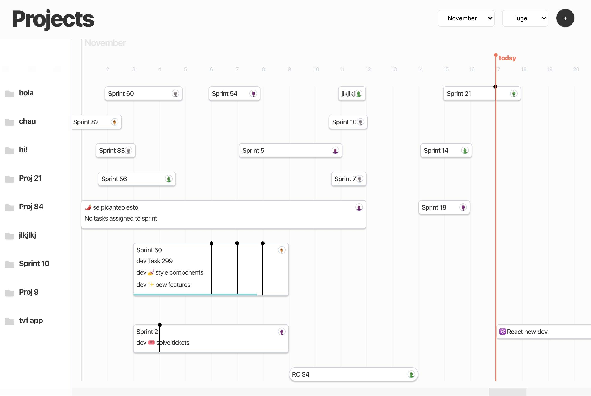

# Projects App


Projects app meant to be an easy way to manage your dev projects in a timeline

### Installing
In order to have the app running it needs the **express** backend api ➡️ [github.com/pablolizardo/projects-api-server](https://github.com/pablolizardo/projects-api-server)
Then you can install the dependencies as usual:

### `npm i`

Create a `.env.local` and set this content:

```
REACT_APP_API_URL=http://localhost:3005/api
```

...and start the app

### `yarn start`

Open [http://localhost:3000](http://localhost:3000) to view it in the browser.
